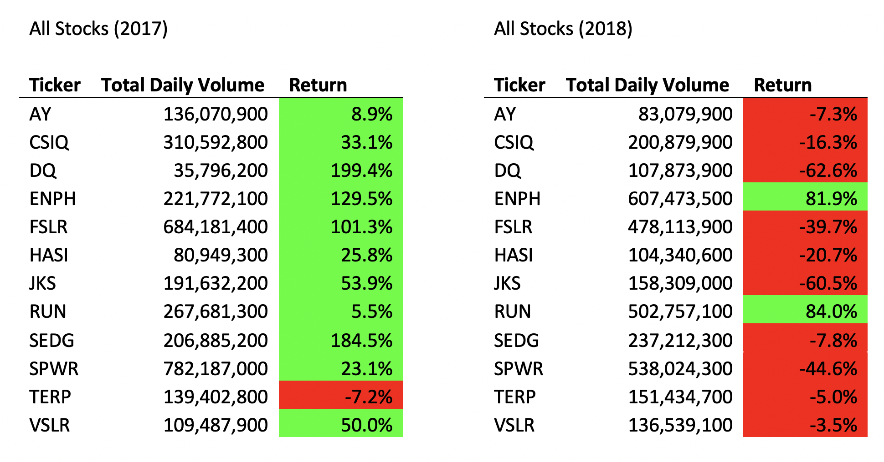

# **Stock Analysis**

## Overview

The primary scope of this stock market analysis is to examine the performance of DAQO New Energy Corporation stock in the years 2017 and 2018. We will observe two metrics for DAQO (DQ) and eleven other organizations in the solar and renewable energy sector for these years: annual return and total daily trading volume. We will compare these metrics between 2017 and 2018 to determine whether an investment in DAQO stock is wise and to identify higher performing corporations in this sector during this timeframe.

Investopedia defines daily trading volume as the number of shares traded per day. In this analysis, we have captured the annual total for each ticker for 2017 and 2018. Some investors prefer higher numbers because a higher trading volume allows for more agile investment exchanges. Lower numbers indicate fewer transactions, therefore fewer opportunities to buy or sell shares. (Mitchell, 2020)

We have additionally captured annual return figures for each year. These figures, expressed as a negative or positive percentage, will identify how a particular stock value has grown over the described year. Higher returns are typically preferrable, assuming the investor is seeking a long-term investment.  

## Results

#### Macro Efficiency
Due to the size of our datasets, we have developed a macro to process our analysis at the push of a button. We found that a macro would lend to a concise and readable end result that the user could apply to compare stock market results for 2017 and 2018 with ease. We can later apply similar principals to new stock market data with minimal time investment through minor updates to our macro code. 

**First Iteration:**

2017:

2018:

Our first iteration of the macro employed nested loops to process through every row of data for each ticker we want to analyze. To determine the amount of time taken to run this first iteration, we initialized a stopwatch module which called our data analysis subroutine. This first iteration of the macro required 1.48 seconds to run our 2017 data and 1.47 seconds to run 2018.

**Refactored Code:**

2017:

2018:

We have refactored the code to eliminate the nested loop and process through the data only one time and collect the data for each ticker and the timer function has been incorporated into our analysis subroutine. Our refactored code now runs for 0.19 seconds for each 2017 and 2018, eliminating over a full second from an already manageable run time.

#### Analysis Results

Our initial analysis of DAQO stock in 2017 and 2018 has provided sufficient information to arrive at an informed decision about buying stock in DAQO New Energy. While DAQO stock saw a promising annual return of 199.4% in 2017, the value of DAQO stock decreased 62.6% by the end of 2018. This could indicate that DAQO stock is volatile and sensitive to market fluctuations. Looking at all twelve corporations, most boasted a high return in 2017 but a much lower return in 2018. Considering this, we can assume that some events will affect the market on a broad scale. While DAQO stock appears to have performed poorly compared to the other twelve tickers, we would want to analyze additional data for subsequent years to determine if any trends or patterns exist. We might find that DAQO stock recovered quite nicely!

We should also review the volume at which DAQO stock was traded. In 2017, DAQO had the lowest total volume out of all twelve organizations we are monitoring. While DAQO also boasted an annual return of 199.4% in the same year, these stocks were traded much less frequently than the others, indicating that should an investor *want* to buy or sell shares, they may not be able to or they may not be able to at their preferred price. In 2018 where DAQO’s annual return dipped severely, its total volume was much higher. An investor would then have more flexibility to engage in transitions regarding this stock. However, the drop in overall return is concerning. If the investor wanted further analysis, we could look at DAQO’s performance over the course of the year.

While many of the observed corporations did not provide a desirable return in 2018, two stand out with an annual return of over 80%: Enphase Energy, Inc. (ENPH) and SunRun, Inc. (RUN). Looking back to 2017, SunRun’s stock grew 5.5% in 2017 while EnPhase Energy’s grew 129.5%. A truly competitive investment portfolio would include a variety of investments; thus it would be wise to invest in multiple companies across numerous sectors. Someone looking to maximize their return in on only one of these corporations would find success, based on the data available here, by investing solely in SunRun. SunRun’s stock grew most impressively year over year between 2017 and 2018. EnPhase, while still promising, started high and grew less overall year over year.

## Summary
Refactoring code can be both advantageous and unfavorable. Refactoring code is often done in an effort to make the code run more efficiently, therefore reducing run or load time for the user. Similarly, code might be refactored to make the program more readable and maintainable. Writing code that can be easily managed by another coder is vital when debugging or working on multi-functional teams.

Nevertheless, refactoring code requires coders to determine whether the time investment required to review and update the code will be of benefit. In most cases, code is initially written as a loose framework that can accept a variety of abstract arguments. Once the programmer has completed the code and confirms the process is working properly, the code may be rewritten to be more rigid and specific to the process. In some cases this may be appropriate, but it could reduce readability and therefore reduce another coder’s ability to maintain the code later.

In the case of our stock analysis macro, refactoring our code saved the user about 1.3 seconds per analysis. Our first iteration of our macro worked as we intended and was well organized and commented. If no one else needed to review the code, we could have left it as it was, and it would have been suitable for our purpose. Since we are providing the macro-enabled workbook to another party, other programmers may need to update it. Thus, refactoring the code was preferable. The refactored code is more flexible and more directly accomplishes the stock analysis. Refactoring undoubtedly increased readability, as all of our subroutines are housed in one module and nested loops can be difficult for other programmers to update or debug. The 1.3 seconds our user would save by running the refactored code might not offset the amount of time required to refactor the code, but the amount of time saved for the next developer to update the code certainly does. 

## References
Mitchell, C. (2020, August 28). Average Daily Trading Volume - ADTV Definition. Retrieved September 28, 2020, from https://www.investopedia.com/terms/a/averagedailytradingvolume.asp
